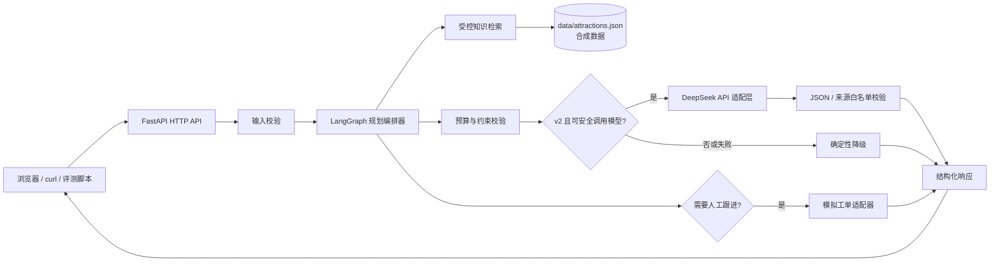
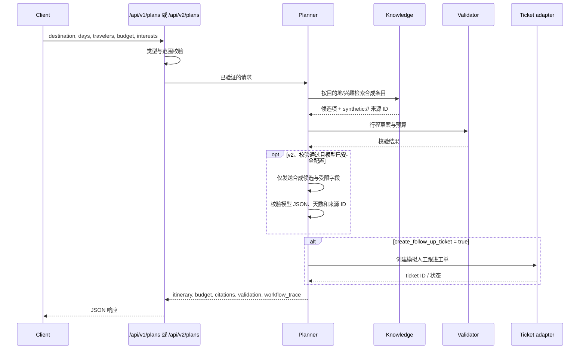

# 架构说明：TravelOps Copilot

## 1. 设计目标

TravelOps Copilot 是一个本地演示用 AI 应用工程 PoC。它的核心目标不是模拟真实旅行平台，而是把一次“帮我规划行程并需要人工跟进”的请求拆成可解释、可测试的步骤：

- **检索**：只从受控的演示知识库返回候选项；
- **规划**：把目的地、天数、人数、预算和兴趣转为结构化日程草案；
- **校验**：显式返回预算、天数等约束的检查结果；
- **交接**：在用户明确选择时创建模拟工单；
- **追溯**：在响应中保留数据来源 ID 和工作流轨迹。

`/api/v1/plans` 是稳定的确定性基线。`/api/v2/plans` 在基线校验通过后，才可选地调用 DeepSeek 生成一段**说明性文本**；它不能改写检索结果、预算、校验结果或工单内容。模型返回必须通过 JSON 结构与来源 ID 白名单校验，否则自动退回确定性结果。

所有知识数据均为原创合成样例，完整边界见 [数据治理说明](data-governance.md)。

Netlify v3 另有一个显式开启的联网检索适配层。它不改变上述 v1/v2 的合成基线：仅当函数运行环境同时有 `TRAVELOPS_LIVE_RETRIEVAL_ENABLED=true` 与服务器端 Tavily Key 时，才会把目的地和所选偏好送往外部检索服务。v3 返回短摘要、`https` 来源链接、获取时间和明确的核验提示；不会把搜索摘要当作已验证的价格、营业状态或可订性。详细边界见 [联网检索说明](live-retrieval.md)。

## 2. 组件视图

### 组件职责

| 组件 | 职责 | 本 PoC 的边界 |
| --- | --- | --- |
| HTTP API | 解析 JSON、参数验证、返回可序列化响应 | 不负责真实用户认证或公网访问 |
| 规划编排器 | 协调检索、排程、校验和可选工单步骤 | 不等同于真实业务规则引擎 |
| 受控知识检索 | 根据目的地/兴趣筛选本仓库数据，附带来源 | 不爬取网页，不提供实时信息 |
| 约束校验器 | 汇总估算成本，标记预算/输入风险 | 不是支付、报价或可订性校验 |
| DeepSeek 适配层（v2 可选） | 仅为已校验的合成候选生成 JSON 说明 | 不接收联系人、备注、密钥或真实业务数据；不改变行程/预算 |
| 联网检索适配层（Netlify v3 可选） | 以 destination/interest 查询网页来源，清洗 URL/摘要并附获取时间 | 不接收备注、联系人或工单；不抓取全文、不作为实时价格/预订/地图事实 |
| 模型输出校验器（v2） | 校验 JSON、逐日覆盖和 `source_id` 白名单 | 不判断真实旅游事实；异常时只保留确定性结果 |
| 模拟工单适配器 | 建立/查询演示工单的结构化接口 | 不连接真实 CRM/ERP/OA |
| 评测脚本 | 仅通过 HTTP 调用黑盒验证契约和预期 | 不读取服务内部状态，不修改业务代码 |

## 3. 一次规划请求的数据流

### 关键设计取舍

1. **先约束，再生成表述。** 预算、天数和已知数据范围应作为结构化字段返回，避免只凭一段文本给出貌似可信的建议。
2. **来源是字段，不是装饰。** 每个候选项需带 `source_title` / `source_url` 或对应 citation；对本演示数据，`synthetic://` 明确表示内部合成 ID。
3. **工作流可观察。** `workflow_trace` 用于让开发者和审查者看出请求经历了什么步骤；它不是生产级审计日志，也不应包含密钥或个人数据。
4. **模型只能补充说明，不能越过控制层。** v2 提示词不含 `notes`、`contact_name`、工单内容或密钥；模型的 `source_id` 必须属于本次受控检索候选。空响应、截断、非法 JSON、未知来源、鉴权/限流/网络错误均返回确定性方案及安全的 `fallback_code`。
5. **外部系统通过适配层隔离。** 当前工单仅为模拟接口。将来接入 CRM 时，应替换适配层并补充鉴权、幂等、审批、审计和失败重试。
6. **公开演示保持无状态。** `TRAVELOPS_PUBLIC_DEMO_MODE=true` 时，API 在工作流触发前拒绝自动建单，并拒绝全部模拟工单读写；前端据 `/health` 隐藏对应入口。该设置不等同于生产级鉴权，而是限制此公开演示的输入和持久化面。
7. **联网模式显式、最小化且可关闭。** v3 未配置 Key 时返回清楚的 `503`，不会伪装为联网；启用后仅向外部服务发送目的地和勾选偏好，并返回 URL、获取时间和缓存状态。函数的每 IP 限流与短时缓存只降低普通滥用，不能替代公开前的全站额度控制。

## 4. 工作流状态

| 步骤 | 输入 | 输出 | 可验证点 |
| --- | --- | --- | --- |
| `parse` | 已通过 HTTP 校验的请求 | 标准化需求与默认偏好 | 输入字段、默认值和范围由 API 先校验 |
| `retrieve` | 目的地、兴趣 | 候选条目、来源 ID | 城市/标签过滤、空结果处理 |
| `plan` | 候选条目、天数 | 按天行程草案与预算估算 | 天数与活动日结构、显式预算假设 |
| `validate` | 草案、人数、预算 | 预算/覆盖检查结果 | 总额与预算关系、失败原因 |
| `revise_once` | 未通过的初版 | 最多一次的预算优先修订 | 不无限循环修订 |
| `augment_with_llm`（仅 v2） | 已校验草案、合成候选 | 通过白名单校验的说明，或降级元数据 | 不把无来源/低预算/原始备注传给模型；失败不改写基线 |
| `finalize` | 已校验结果与明确的工单开关 | API JSON、可选模拟工单 | 引用、校验、轨迹字段；仅显式请求时创建工单 |

## 5. 失败边界与降级原则

| 场景 | 应有行为 | 不应有行为 |
| --- | --- | --- |
| 参数非法 | 返回清晰的 4xx 与字段级提示 | 静默猜测天数或预算 |
| 目的地无匹配数据 | 明确说明演示知识库未覆盖，返回空候选/可行动提示 | 编造景点、价格、营业时间或来源 |
| 预算不足 | 返回预算校验失败或警告及可见原因 | 声称“已预订”或伪造折扣 |
| 工单失败 | 返回失败状态/错误信息，保留可复盘上下文 | 假装工单已经提交到真实系统 |
| LLM/网络服务不可用 | 返回确定性 v2 结果和非敏感 `fallback_code`；最多对可重试错误重试一次 | 泄露密钥、原始供应商错误或输出未经验证事实 |
| LLM 返回未知来源/无效 JSON/截断 | 丢弃模型文本，保留确定性行程与预算 | 让模型文本覆盖来源、预算或行程结构 |
| 联网检索未配置/鉴权失败/限流/超时 | 返回安全的 v3 错误码与可读提示，不转成合成结果 | 把失败标成“联网成功”、泄露 Key/原始供应商错误或借用别城景点 |
| 联网检索无来源 | 返回 `no_results` 和待补充状态 | 编造景点、价格、营业时间、交通或预订状态 |

## 6. 生产化前仍缺少的内容

本项目有意不把以下工作包装为已完成：身份认证与权限、多租户隔离、PII 分级与脱敏、数据库迁移、幂等/重试、限流、监控告警、真实数据授权、真实 CRM 集成、供应商 SLA、提示词注入防护和上线审批。

这些并不是“无关紧要的细节”。把它们列为边界，能证明你理解 PoC 与生产系统之间的差距。
